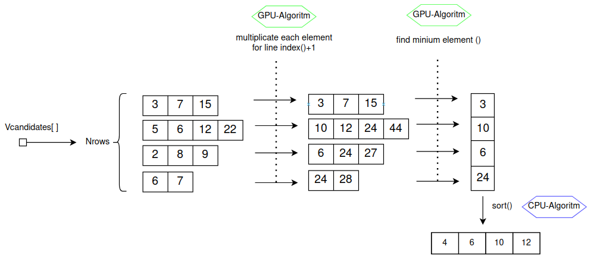

# Experiment Cuda

## How to compile?

`nvcc -lcublas <fileCuda.cu>`

## What is it?

In this directory you can find some experiments for cuda optimization

## Usefull links

- [Thrust-algoritm sort_function()](https://nvidia.github.io/cccl/thrust/api/groups/group__algorithms.html)
- [Cudacublas min_function()](https://docs.nvidia.com/cuda/cublas/index.html#cublasi-t-amin)

### opt1.cu

#### Obiettivo ottimizazione

 </img>

#### Simulazione

Come passo intermedio, creo un programma più semplice ma molto simile al programma finale desiderato.

 </img>

