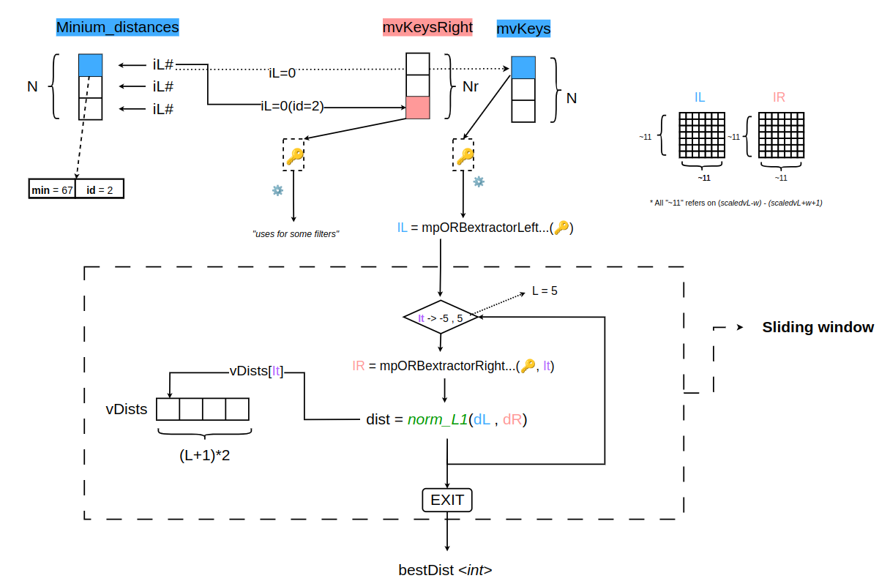

e# Experiment Cuda


## How to compile?

`nvcc -lcublas <fileCuda.cu>`


## What is it?

In this directory you can find some experiments for cuda optimization.  
And explanation of the iterative algoritmh.

- <b>Frame.cc</b> contains the function to optimize.
- <b>Gpu_stereoMatches.cu</b> contains the optimization of the function.
- <b>Gpu_stereoMatches.h</b> contains the header optimization of the function.

## Usefull links

- [Thrust-algoritm sort_function()](https://nvidia.github.io/cccl/thrust/api/groups/group__algorithms.html)
- [Cudacublas min_function()](https://docs.nvidia.com/cuda/cublas/index.html#cublasi-t-amin)

## Explanation part1 of the iterative algorithm


 </img>

## Explanation part2 of the iterative algorithm

 </img>


#### Simulazione

Come passo intermedio, creo un programma più semplice ma in parte simile al programma finale desiderato.

 </img>

- Le strutture dati utilizzate possono essere molto diverse dall'esempio.
- Il procedimento è molto più complesso.
- Questo è uno schema ad "altissimo" livello.

<br><br>

### Ottimizazione1 - ComputeStereoMatches

 </img><br>

#### Find Distance

 </img><br><br>

#### Find Minium Distance

 </img><br>

#### Sliding Window (change some minium distance)

 </img><br>


#### Steps

1.Integrazione codice CUDA nel codice sorgente

- Creazione di 2 nuovi file: <b>src/\<file\>.cu</b> , <b>include/\<file\>.h</b>.
- Aggiungere al file <b>/CmakeLists.txt</b> i 2 file creati.

<br>

2.Capire quali variabili vanno trasportate su Gpu.


```c++
std::vector<std::vector<size_t>> vRowIndices    // Cuda Global Memory
std::vector<cv::KeyPoint> mvKeys                // Cuda Global Memory
std::vector<cv::KeyPoint> mvKeysRight           // Cuda Global Memory
float minZ                                      // Cuda Constant Memory   
float minD                                      // Cuda Constant Memory   
float maxD                                      // Cuda Constant Memory   
int TH_HIGH                                     // Cuda Constant Memory   
cv::Mat mDescriptors                            // Cuda Global Memory
cv::Mat mDescriptorsRight                       // Cuda Global Memory
std::vector<float> mvInvScaleFactors            // Cuda Global Memory
std::vector<float> mvScaleFactors               // Cuda Global Memory
std::vector<size_t> size_refer                  // Cuda Global Memory
...
```

<br>

3.Creare array per navigazione della struttura dati principale <b>vRowIndices</b> (array multi-dimensionale irregolare).

<b> size_refer </b> + <b> incremental_size_refer </b>

 </img>

- size_refer -> Rappresenta il numero di colonne per ogni riga.
- incremental_size_refer -> Rappresenta il numero di colonne fino a quella riga(riga compresa).

<br>

4.Riscrittura della funzione ```int ORBmatcher::DescriptorDistance(const cv::Mat &a, const cv::Mat &b)``` trasformandola in una funzione `__device__`.


- Funzione originale :

```c++
int ORBmatcher::DescriptorDistance(const cv::Mat &a, const cv::Mat &b){
        const int *pa = a.ptr<int32_t>();
        const int *pb = b.ptr<int32_t>();

        int dist=0;

        for(int i=0; i<8; i++, pa++, pb++)
        {
            unsigned  int v = *pa ^ *pb;
            v = v - ((v >> 1) & 0x55555555);
            v = (v & 0x33333333) + ((v >> 2) & 0x33333333);
            dist += (((v + (v >> 4)) & 0xF0F0F0F) * 0x1010101) >> 24;
        }

        return dist;
}
```

- Funzione presente in <b>ORBmatcher.cc</b> (trasformata per essere eseguibile su GPU)


```c++
__device__ int DescriptorDistance(const unsigned char *a, const unsigned char* b){

    int dist=0;

    const int32_t* a_int = reinterpret_cast<const int32_t*>(a);
    const int32_t* b_int = reinterpret_cast<const int32_t*>(b);

    for(int i=0; i<8; i++) {
        unsigned int v = a_int[i] ^ b_int[i];
        v = v - ((v >> 1) & 0x55555555);
        v = (v & 0x33333333) + ((v >> 2) & 0x33333333);
        dist += (((v + (v >> 4)) & 0xF0F0F0F) * 0x1010101) >> 24;
    }

    return dist;
}
```
<br><br>

5.Analisi di <b>ORBextractor.h</b> per capire se è possibile l'utilizzo di variabili già salvate nella GPU.

```c++
// ORBSLAM3/include/ORBextractor.h

//piramidi
uchar *d_images;              // livelli > 0
uchar *d_inputImage;          // livello = 0  (original img)
uchar *d_imagesBlured;        // livelli > 0  [sfuocata]
uchar *d_inputImageBlured;    // livello = 0  (original img) [sfuocata] 
uchar *outputImages;          // OUTPUT IMG
float *d_scaleFactor;         // [] -> size=8 each element rappresent one level

// ORBSLAM3/src/gaussian_blur.cu
//Conversion example
const float scaleFactor = d_scaleFactor[level];
const uint new_rows = round(old_h * 1/scaleFactor);
const uint new_cols = round(old_w * 1/scaleFactor);
```

Graphic explanation:

 </img><br><br>


6.Aggiunta dei getter per ottenere i dati necessari

```c++
// ORBSLAM3/include/ORBextractor.h
int getRows(){
    return rows;
}

int getCols(){
    return cols;
}

uchar *getd_images(){
    return d_images();
}

float* getd_scaleFactor(){
    return d_scaleFactor;
}
```
