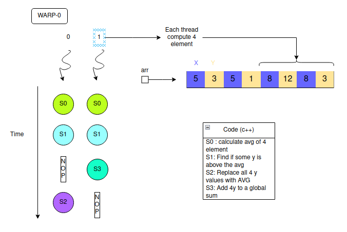

# Esempi semplici di programmi CUDA e C++

⚠ Attenzione! Per vedere se la scheda video funziona correttamente compiilare ed eseguire il seguente script :  `nvcc test_gpu.cu`

## How to compile ?

`nvcc <fileCuda.cu>`

## Exercise


### init_array

Programma che inizializza un array di N elementi. Ogni elemento
è inizializzato a 0 e successivamente viene sommato l'id del thread che lo inizializza.
Viene instanziato solamente un **blocco**.
⚠ Inoltre si nota che con _n > 1024_ l'inizializzazione non funziona più.
Questo poichè di default i thread massimi per blocco sono _1024_

### 2d.cu

Programma che inizializza una matrice di NxM elementi in parallelo. Ogni elemento
è inizializzato con l'id del thread che lo inizializza.
Viene instanziato solamente un **blocco** , ma vengono utilizzati **thread.x** , **thread.y** e **thread.z**.

### grid_example.cu

Programma che mostra la creazione di una **grid** avente numerosi **blocchi** al suo interno.
Utilizzo di `gridDim.x , gridDim.y , ...` e `blockDim.x , blockDim.y , ...`.

### class_example.cpp

Programma c++ che mostra le funzioni base di una classe.

### shared_memory.cu

You are given a 1024x1024 integer matrix M.
Each row is assigned to a thread block.
Each thread is assigned a matrix element `M[i][j]`.
It changes `M[i][j] to M[i][j] + M[i][j+1]` (Exploit shared memory)

### cuda_divergent.cu

It shows an example of cuda divergents

### deterministic_output_warps.cu

In this programm you can see how warps work. The output is deterministic because every instruction stay in the warp.
( Warp-threads are fully synchronized, there is an implicit barrier after each step/instruction )


</img><br><br>


### dinamic_memory_multi_arrays.cu

In this programm it's used the dinamic shared memory to use 2 array.

</img><br><br>


### data_race1.cu


_Write CUDA code for the following functionality:_

_Data:_

```c++
struct Point { 
    int x,y;
}
int arr[N]; 
```

1. Assume following data type, filled with some values
2. Each thread should operate on 4 elements  
3. Find AVG of x values.  
4. If a thread sees y value above the average, it replaces all 4 y values with AVG.  
Otherwise, it adds y values to a global sum.  
5. Host prints the number of elements set to AVG.  


<br>_Graphic explanation:_  
_
</img><br><br>


### grading.cu

Given roll numbers and marks of 80 students in GPU programming,assign grades.

- Return an array of  [Valuation , Number of student]

- Use input arrays and output array.

|Name valuation  |Number valuation |
|----------------|-----------------|
|S|90|
|A|80|
|B|70|
|C|60|
|D|50|
|E|40|
|U|0|

- Example:

Input = [ (1,90) , (2,80) , (3,80), (4,90) , (5,0) , (6,80) , (7,80)]  
Output = [ S = 2 , A = 3 , B = 0 , ... , U = 1 ]


### AtomicCas_example.cu

This pgm shows the use of atomicCas.

- On most executions, you would see the output of the first if.
- And could happened that thread1 executes the third if.


### Warp votes.cu

This pgw shows the use of warp votes. The main functions are:

- `__all(predicate)` → True if all warp threads satisfy the predicate.
- `__any(predicate)` → True if at least one warp satisfy the predicate.
- `__ballot(predicate)` → Return a 32bit integer (every bit rappresent true/false of a warp):
  - Example of __ballot int `<001000000010010111110000000100101>`


