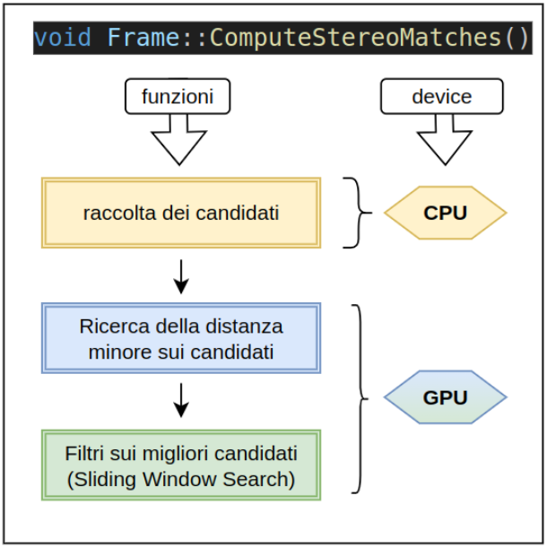
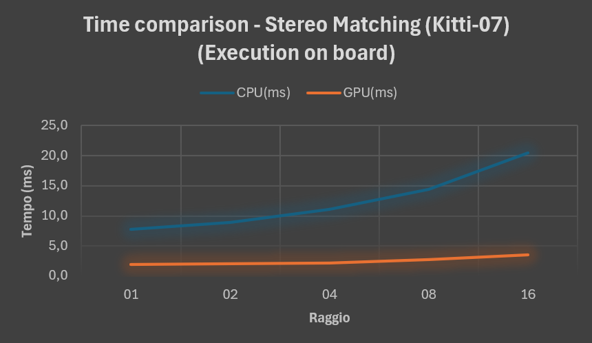
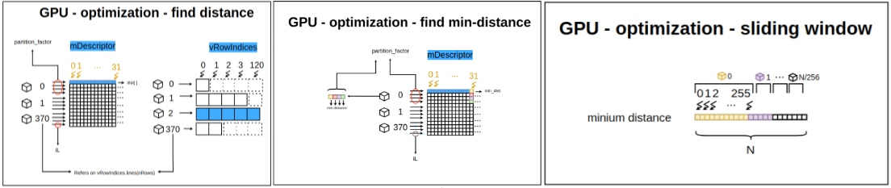

# GPU Algorithm

This repository hosts a project focused on transforming a Stereo Matching algorithm from a sequential paradigm to a parallel implementation using CUDA. 

The specific function used in this project is derived from the following repository: [CUDA-Accelerated ORB-SLAM](https://git.hipert.unimore.it/fmuzzini/cuda-accelerated-orb-slam), developed by the *Hipert Lab* at the University of Modena (UNIMORE).  

👉 **Advice**: If you want to try the software, you need to clone the repository from the *Hipert Lab* linked above!  

### Contents of this repository:
- **Documentation**: Detailed explanation of the function code (located in `/Documentation/ORB-SLAM`).
- **CUDA Files**: Additional CUDA files integrated into the project (found in `/CUDA`).
- **Benchmarks**: Performance comparisons between the original and optimized versions (available in `/Test`).
- **Presentation**: A formal presentation of the work (located in `/Presentation`).

## Optimization Scheme

---

## Example Results

---

## CUDA Optimization Scheme

